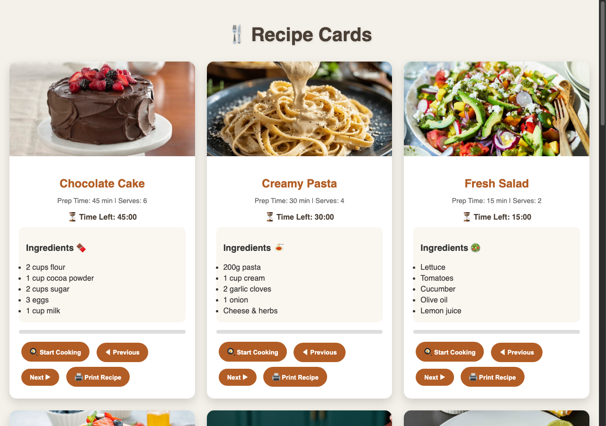
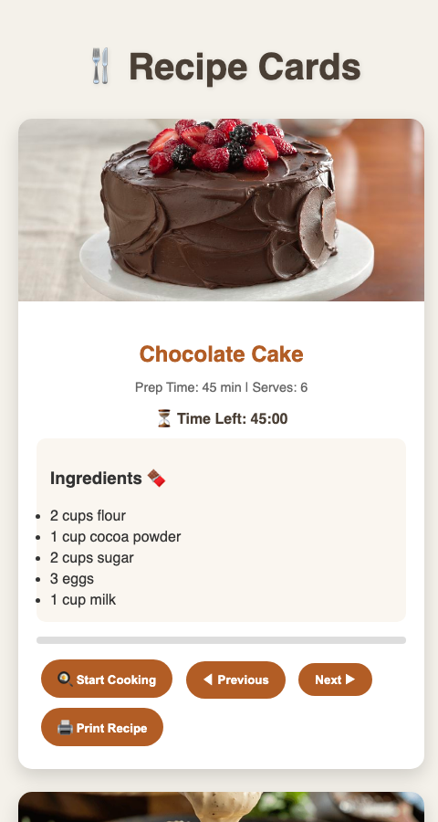

# Recipe Cards 🍳

A recipe card web module — a small, self-contained UI component for displaying recipes in a clean card layout.

## Tech Stack

HTML5, CSS3, JavaScript

## Running Locally

```bash
git clone https://github.com/Ashmita-Nath/Recipe-Cards.git
cd Recipe-Cards
python3 -m http.server 8000
```

Then visit `http://localhost:8000/recipieCard.html`.

## Screenshots

### Desktop View


### Mobile Responsive View


## Author

Ashmita N Nath — [GitHub](https://github.com/Ashmita-Nath)
