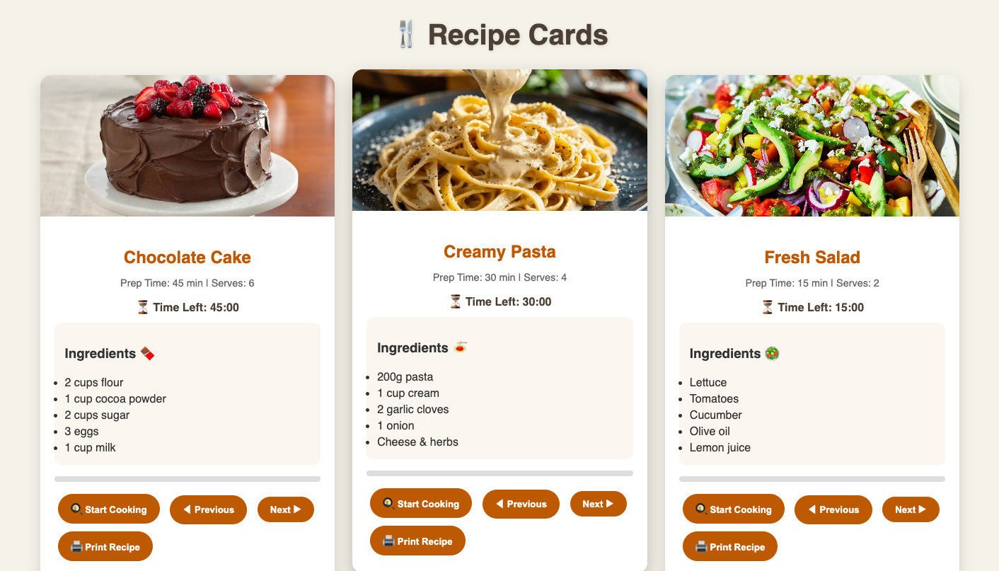

# Recipe Cards 🍳

A recipe card web module — a small, self-contained UI component for displaying recipes in a clean card layout.

## Tech Stack

- HTML5
- CSS3
- JavaScript

## Running Locally

No build step or dependencies required.

**Option 1 — Quickest**
1. Clone the repo: `git clone https://github.com/Ashmita-Nath/Recipe-Cards.git`
2. Open `recipieCard.html` directly in your browser (double-click the file, or right-click → Open With → your browser).

**Option 2 — Recommended (fixes relative-path/asset issues)**
1. Open the project folder in VS Code.
2. Install the **Live Server** extension.
3. Right-click `recipieCard.html` → **Open with Live Server**.

**Option 3 — No extensions needed**
```bash
cd Recipe-Cards
python3 -m http.server 8000
```
Then visit `http://localhost:8000/recipieCard.html` in your browser.

## Screenshots

_Add screenshots here once captured — see the project's own screenshot files in the repo root for reference shots._



## Author

Ashmita N Nath — [GitHub](https://github.com/Ashmita-Nath)
